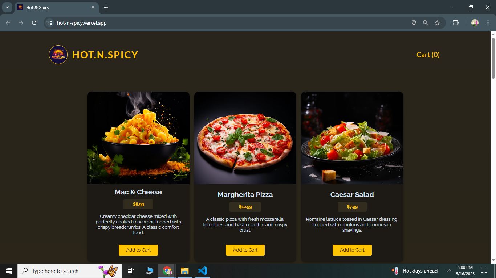
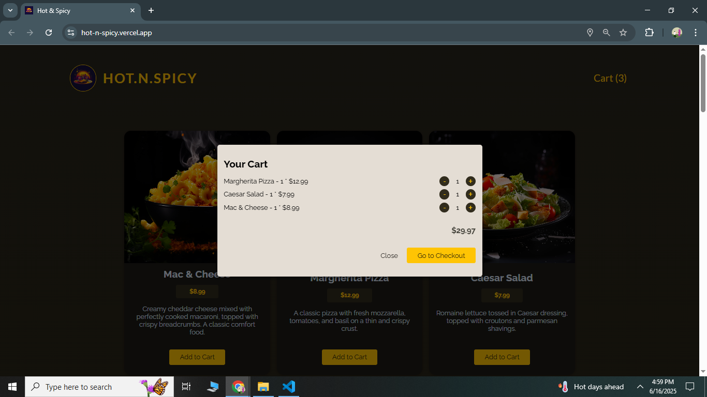
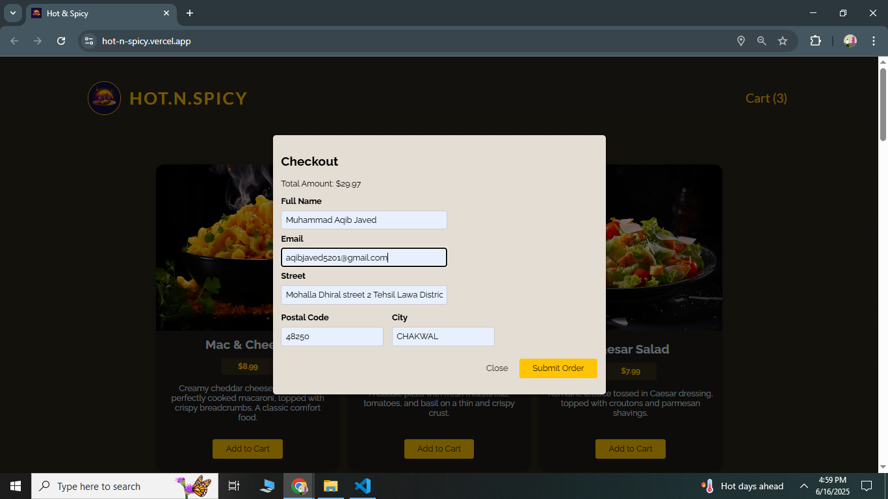

# 🍽️ Hot.N.Spicy - React Food Order App

A modern, responsive food ordering application built with **React 19** and **Node.js**. Users can browse meals, add them to a cart, adjust quantities, and place orders through a checkout form. The project showcases advanced React features like hooks, Context API, and custom hooks.

## 🚀 Live Preview

- 🔗 **Frontend**: [https://hot-n-spicy.vercel.app](https://hot-n-spicy.vercel.app)
- 🔗 **Backend API**: [https://hot-n-spicy-server.vercel.app/api/meals](https://hot-n-spicy-server.vercel.app/api/meals)

## 🛠️ Tech Stack

- **Frontend:** React 19 (with Vite)
- **Backend:** Node.js (Vercel Serverless Functions)
- **State Management:** `useState`, `useReducer`, Context API
- **HTTP Requests:** Custom Hook with Fetch API
- **Styling:** CSS Sheets

## 📦 Features

- 🍜 **Meal Listing:** Fetch and display meals from a live backend API.
- 🛒 **Cart Management:**
  - Add meals to cart
  - Increase/decrease quantity
  - Remove items
- 🧾 **Checkout Form:**
  - User fills billing info
  - Submit order to backend
- 🔄 **Efficient State Management:**
  - Local state via React Hooks
  - Global cart state via Context
- ⚙️ **Custom Hook:**
  - `useHttp()` handles GET/POST with loading & error states.

## 📁 Folder Structure

```

hot-n-spicy/
│
├── public/
│   └── images/       # Static meal images
├── src/
│   ├── components/
│   │   ├── Cart/
│   │   ├── Meals/
│   │   ├── UI/
│   │   └── Layout/
│   ├── hooks/
│   │   └── use-http.js
│   ├── store/
│   │   ├── CartContext.js
│   │   └── UserProgressContext.js
│   ├── App.jsx
│   └── main.jsx
├── api/
│   ├── meals.js       # GET meals
│   └── orders.js      # POST orders
└── README.md

```

> **Note**: Both frontend and backend are deployed on [Vercel](https://vercel.com/), with backend using [Vercel Serverless Functions](https://vercel.com/docs/functions).

## 🌐 Environment Variables

Frontend uses the following environment variable:

```env
VITE_API_URL=https://hot-n-spicy-server.vercel.app
```

Use it to dynamically point to backend URL like:

```js
const baseUrl = import.meta.env.VITE_API_URL;
fetch(`${baseUrl}/api/meals`);
```

## 🔧 Getting Started (Development)

### Prerequisites

- Node.js (v18+)
- npm or yarn

### 1. Clone the Repository

```bash
git clone https://github.com/AqibNiazi/hot-n-spicy.git
cd hot-n-spicy
```

### 2. Install Dependencies

```bash
npm install
```

### 3. Start the App (Frontend + Backend in Dev)

```bash
npm run dev
```

Then open [http://localhost:5173](http://localhost:5173) in your browser.

## 📸 Screenshots





## 💡 Key React Concepts Used

- ✅ React 19
- 🔁 `useReducer` for cart logic
- 🧠 Context API for global state
- 🌐 Custom `useHttp` Hook for API requests
- 🎯 Clean, modular file structure

## 📝 TODO

- [ ] Add loading indicators to meals page
- [ ] Store orders persistently (e.g. Firebase or DB)
- [ ] Add search & filter to meals

## 📬 Feedback & Contributions

Issues and PRs are welcome!

If you find this project helpful, please ⭐ it on [GitHub](https://github.com/AqibNiazi/hot-n-spicy).

## 📄 License

This project is licensed under the [MIT License](LICENSE).

> Built with ❤️ by [Aqib Niazi](https://github.com/AqibNiazi)
